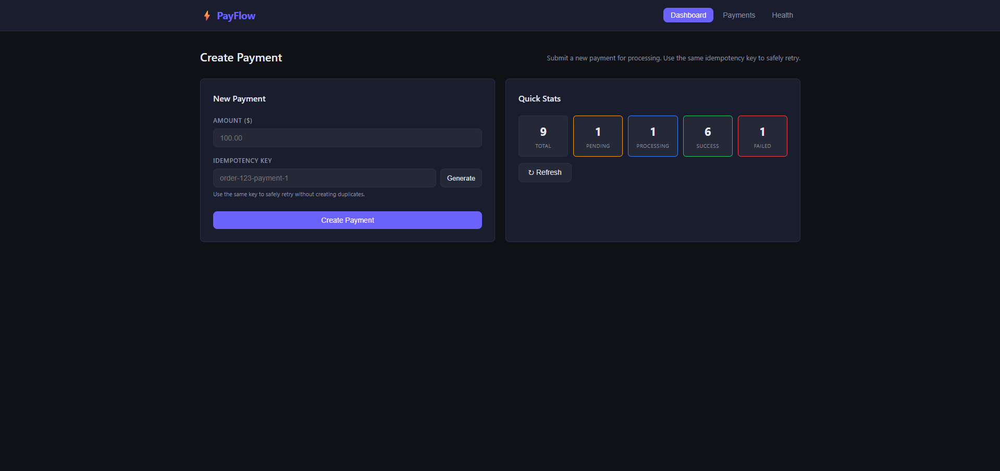
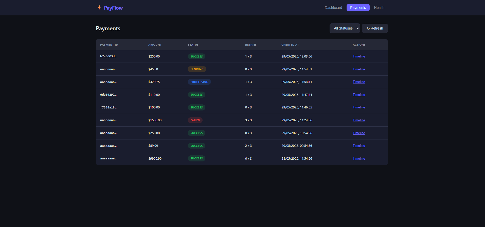
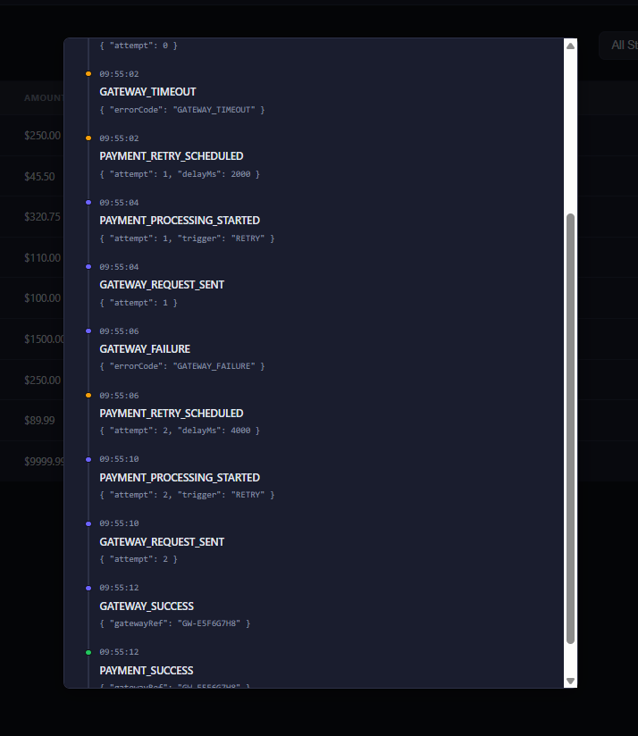
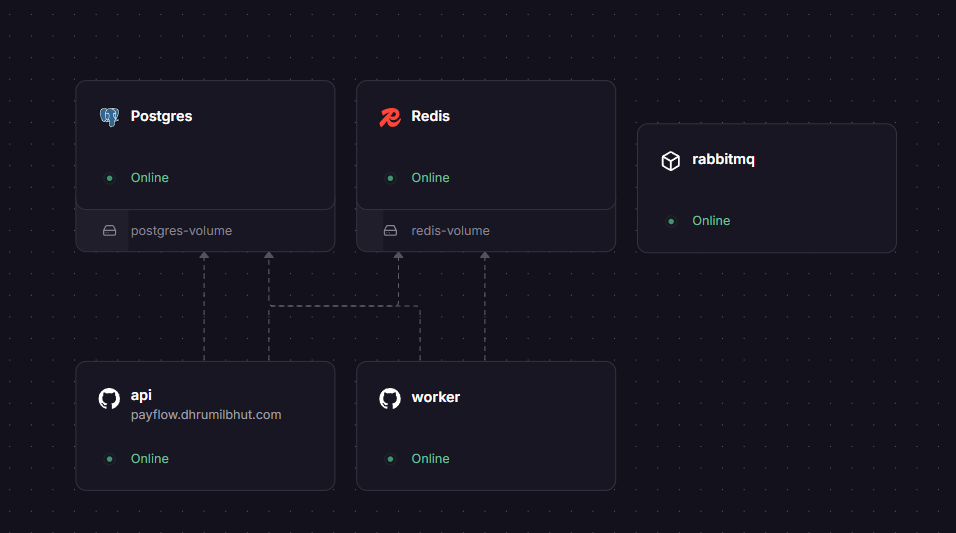

# ⚡ PayFlow

> A production-grade, resilient payment processing system built with Node.js, PostgreSQL, RabbitMQ, and Redis — demonstrating real-world distributed systems patterns.

🌐 **Live Demo:** [payflow.dhrumilbhut.com](https://payflow.dhrumilbhut.com)

---



---

## ✨ Features

- 🔁 **Idempotent payments** — same key, same result, no duplicates ever
- ⚙️ **Async processing** — RabbitMQ decouples API from worker
- 🔄 **Exponential backoff retries** — via Dead Letter Exchange (no `setTimeout`)
- 🔒 **Two-layer concurrency control** — Redis lock + PostgreSQL `FOR UPDATE`
- ⚡ **Circuit breaker** — fast-fail when gateway is down (Opossum)
- 🪝 **Idempotent webhooks** — duplicate callbacks safely ignored
- 📋 **Full audit trail** — every state change recorded with metadata
- 🩺 **Health checks** — liveness + dependency readiness endpoints
- 📖 **Swagger UI** — interactive API documentation

---

## 🏗️ Architecture

```
┌─────────────────────────────────────────────────────────────┐
│                        Architecture                         │
│                                                             │
│  ┌─────────┐   ┌───────────────────────────────────────┐    │
│  │ Browser │──>│  API  (Express)                       │    │
│  └─────────┘   │  REST · Rate limiting · Validation    │    │
│                └─────────────────┬─────────────────────┘    │
│                                  │ publish                  │
│                                  ▼                          │
│          ┌───────────────────────────────────────────┐      │
│          │  RabbitMQ                                 │      │
│          │  ├─ payment.process.queue                 │      │
│          │  └─ payment.retry.queue  <── DLX backoff  │      │
│          └──────────────────┬────────────────────────┘      │
│                             │ consume                       │
│                             ▼                               │
│          ┌───────────────────────────────────────────┐      │
│          │  Worker  (separate container)             │      │
│          │  Redis lock → DB lock → Gateway call      │      │
│          └───────────────────────────────────────────┘      │
│                                                             │
│  ┌────────────┐   ┌──────────┐   ┌──────────────────────┐   │
│  │ PostgreSQL │   │  Redis   │   │  Gateway Simulator   │   │
│  │  3 tables  │   │  locks   │   │  70/20/10 outcomes   │   │
│  └────────────┘   └──────────┘   └──────────────────────┘   │
└─────────────────────────────────────────────────────────────┘
```

---

## 🚀 Live Demo

| Service | URL |
|---------|-----|
| 🖥️ Dashboard | [payflow.dhrumilbhut.com](https://payflow.dhrumilbhut.com) |
| 📖 Swagger UI | [payflow.dhrumilbhut.com/swagger](https://payflow.dhrumilbhut.com/swagger) |
| 🩺 Health | [payflow.dhrumilbhut.com/health/dependencies](https://payflow.dhrumilbhut.com/health/dependencies) |

---

## 🛠️ Local Development

**Prerequisites:** Docker Desktop

```bash
# Start everything
docker-compose up --build

# Seed sample data (optional but recommended)
docker-compose exec api node src/database/seed.js
```

| Service | URL | Credentials |
|---------|-----|-------------|
| 🖥️ Dashboard | http://localhost:3000 | — |
| 📖 Swagger UI | http://localhost:3000/swagger | — |
| 🐰 RabbitMQ UI | http://localhost:15672 | guest / guest |
| 🩺 Health | http://localhost:3000/health/dependencies | — |

---



---

## 💳 Payment Lifecycle

```
POST /payments
      │
      ▼ (synchronous — returns immediately)
   PENDING ────────────────────────────▶ RabbitMQ
      │
      │  Worker picks up
      ▼
  PROCESSING ──▶ Gateway ──▶ ✅ SUCCESS  (terminal)
                    │
                    ├──▶ 🔄 RETRY_SCHEDULED ──▶ wait (DLX) ──▶ PROCESSING
                    │
                    └──▶ ❌ FAILED  (terminal, retries exhausted)
```

> `RETRY_SCHEDULED` is internal only — the API exposes it as `PROCESSING`

---

## 🔄 Retry Strategy

```
delay = 2000ms × (2 ^ attempt)

Attempt 1 →  2s
Attempt 2 →  4s
Attempt 3 →  8s
```

Retries use RabbitMQ **Dead Letter Exchange (DLX)** — not `setTimeout`.
If the worker crashes mid-wait, the retry is not lost. It lives in the queue.

---

## 🔒 Concurrency Control

Two independent layers protect against double-processing:

| Layer | Mechanism | Scope |
|-------|-----------|-------|
| 1️⃣ Redis | `SET NX EX` + Lua release script | Cross-process / cross-machine |
| 2️⃣ PostgreSQL | `SELECT FOR UPDATE SKIP LOCKED` | Inside transaction |

If Redis fails → DB lock catches it. Belt **and** suspenders.

---

## ⚡ Circuit Breaker

```
CLOSED ──(50%+ failures over 5+ calls)──▶ OPEN
  ▲                                          │
  │                                   (30s reset)
  └──(test call succeeds)────────── HALF_OPEN
```

When **OPEN**: gateway is not called — requests fail fast in milliseconds.
State changes are recorded as audit events.

---

## 🪝 Webhook Handling

| Scenario | Behavior |
|----------|----------|
| Duplicate `eventId` | Ignored — DB `UNIQUE` constraint |
| Arrives before worker finishes | Redis lock serializes access |
| `SUCCESS` after payment `FAILED` | ✅ Reconciled to `SUCCESS` |
| `FAILED` after payment `SUCCESS` | Ignored — trust `SUCCESS` |
| Multiple concurrent webhooks | DB row lock prevents race |

---




---

## 🗄️ Database Schema

```
payments          — core record, idempotency_key UNIQUE
payment_events    — append-only audit trail (JSONB metadata)
webhook_events    — deduplication by external_event_id UNIQUE
schema_migrations — tracks applied migrations
```

**Database commands:**

```bash
npm run db:migrate    # apply pending migrations
npm run db:rollback   # undo last migration
npm run db:status     # show applied vs pending
npm run db:seed       # insert sample data
npm run db:reset      # drop all + re-migrate (dev only)
```

---

## 🌐 API Reference

| Method | Endpoint | Description |
|--------|----------|-------------|
| `POST` | `/payments` | Create payment *(idempotent, rate-limited)* |
| `GET` | `/payments` | List payments `?status=` filter |
| `GET` | `/payments/stats` | Count by status (single GROUP BY) |
| `GET` | `/payments/:id` | Get payment detail |
| `GET` | `/payments/:id/events` | Full audit timeline |
| `POST` | `/webhook` | Receive gateway callback |
| `GET` | `/health` | Liveness ping |
| `GET` | `/health/dependencies` | Postgres + Redis + RabbitMQ check |

---

## 🧪 Testing

```bash
npm test                  # all 47 tests
npm run test:unit         # state machine, retry logic, circuit breaker
npm run test:integration  # full HTTP layer (mocked dependencies)
npm run test:coverage     # with coverage report
```

Tests cover: idempotency · state transitions · retry math · webhook deduplication · concurrency · circuit breaker · health endpoints

---

## 📁 Project Structure

```
src/
├── config/           # All env vars in one place
├── database/         # Connection pool, migrations, seed
├── state-machine/    # Centralized transition validator
├── repositories/     # DB access only (one per table)
├── audit/            # Audit event service + event constants
├── gateway/          # Simulator + circuit breaker (Opossum)
├── locks/            # Redis SET NX + Lua release
├── messaging/        # RabbitMQ topology + publish helpers
├── services/         # Business logic
│   ├── paymentService.js     # Create / retrieve
│   ├── paymentProcessor.js   # Worker processing loop
│   └── webhookService.js     # Webhook conflict resolution
├── controllers/      # HTTP in → service call → HTTP out
├── routes/           # Express router
├── middleware/        # Error handler · rate limiter · logger
├── validators/       # express-validator rules
└── workers/          # Worker entry point + graceful shutdown

public/               # Vanilla HTML/CSS/JS frontend
tests/
├── unit/             # Pure function tests (zero I/O)
└── integration/      # HTTP tests with mocked deps
```

---

## ⚖️ Tradeoffs

| Decision | Why | Downside |
|----------|-----|----------|
| API + Worker as separate containers | Independent scaling, fault isolation | More ops overhead |
| DLX retry over cron | Survives worker crashes, no scheduler needed | Harder to inspect delayed messages |
| Two concurrency layers | Belt-and-suspenders safety for payments | Tiny extra latency |
| In-memory rate limiter | Zero setup | Doesn't scale across multiple API replicas |
| Gateway simulator in-process | Simple for demo | In prod: real HTTP client with mTLS + timeout |

---

## 🔭 Future Improvements

- [ ] Redis-backed rate limiter (multi-instance safe)
- [ ] Multi-currency support
- [ ] Webhook HMAC signature verification
- [ ] Dead-letter queue for poison messages
- [ ] Prometheus `/metrics` endpoint
- [ ] OpenTelemetry distributed tracing
- [ ] Payment refund / reversal flow
- [ ] Multi-gateway routing with fallback

---

## ☁️ Deployment

Deployed on **Railway** with 5 services on a private internal network:

```
payflow-api     → node src/server.js          (custom domain)
payflow-worker  → node src/workers/paymentWorker.js
postgres        → Railway managed plugin
redis           → Railway managed plugin
rabbitmq        → Docker image (rabbitmq:3.13-management-alpine)
```

Migrations run automatically on every API deploy via the start command.



---

## 🛠️ Tech Stack

`Node.js` · `Express` · `PostgreSQL` · `RabbitMQ` · `Redis` · `Opossum` · `Pino` · `Jest` · `Docker` · `Railway`
